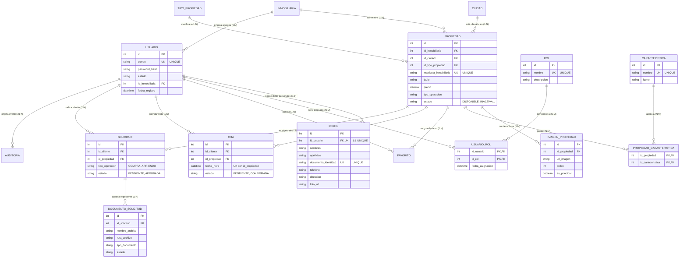

# Modelo Entidad-Relación y Relacional: Sistema Inmobiliario MVC

Este documento describe la arquitectura lógica y física de datos del sistema inmobiliario, demostrando el cumplimiento estricto de la **Tercera Forma Normal (3FN)** y la implementación de las relaciones requeridas: **1:1**, **1:N** y **N:M**.

---

## 1. Diagrama Entidad-Relación (Mermaid ER)

---

## 2. Justificación Pedagógica de las Relaciones

### 2.1. Relación 1:1 Estricta (`usuario` ↔ `perfil`)
- **Justificación:** Se separan responsabilidades de seguridad (credenciales, contraseña con hash BCrypt y estado de cuenta) de los datos civiles del individuo (nombres, cédula, teléfono, dirección).
- **Garantía en Base de Datos:** La columna `perfil.id_usuario` cuenta con una restricción `UNIQUE` y es `FOREIGN KEY` hacia `usuario(id)`. Esto impide físicamente que un usuario tenga dos perfiles o que un perfil pertenezca a más de un usuario.

### 2.2. Relaciones 1:N Obligatorias
- **`inmobiliaria` → `propiedad`:** Cada propiedad pertenece exclusivamente a una inmobiliaria responsable, pero una inmobiliaria administra múltiples propiedades en cartera.
- **`propiedad` → `imagen_propiedad`:** Una propiedad tiene una galería de múltiples fotografías ordenadas con portada principal, pero cada imagen pertenece a un solo inmueble.
- **`cliente` → `cita`:** Un usuario cliente puede solicitar visitas a diferentes inmuebles en distintos horarios.
- **`solicitud` → `documento_solicitud`:** Un trámite de compra o arriendo exige un expediente de múltiples soportes digitales (cédula, carta laboral, extractos bancarios).

### 2.3. Relaciones N:M Obligatorias
- **`usuario` ↔ `rol` mediante `usuario_rol`:**
  - Un usuario puede tener múltiples roles (por ejemplo, el usuario `admin@inmobiliaria.com` tiene asignado simultáneamente el rol `ADMINISTRADOR` y el rol `AGENTE`).
  - Un rol pertenece a múltiples usuarios.
  - La tabla intermedia utiliza una **llave primaria compuesta** `PRIMARY KEY (id_usuario, id_rol)`, lo que evita a nivel de motor registrar dos veces el mismo rol a la misma persona.
- **`propiedad` ↔ `caracteristica` mediante `propiedad_caracteristica`:**
  - Un inmueble puede contar con piscina, gimnasio y ascensor.
  - Al mismo tiempo, la amenidad "Piscina" está presente en decenas de propiedades.
  - Llave primaria compuesta: `PRIMARY KEY (id_propiedad, id_caracteristica)`.

---

## 3. Justificación de la Tercera Forma Normal (3FN)

1. **Primera Forma Normal (1FN):**
   - Todos los atributos son atómicos (no existen campos multivaluados como listas de características o listas de URLs de fotos separadas por comas en la tabla `propiedad`).
   - Cada tabla cuenta con una Llave Primaria identificadora.
2. **Segunda Forma Normal (2FN):**
   - Cumple 1FN y todos los atributos que no forman parte de la clave primaria dependen de forma funcional completa de la llave primaria. En las tablas con llaves compuestas (`usuario_rol`, `propiedad_caracteristica`), no existen dependencias parciales.
3. **Tercera Forma Normal (3FN):**
   - Cumple 2FN y no existen dependencias transitivas (ningún campo no clave depende funcionalmente de otro campo no clave).
   - Por ejemplo, en `propiedad` no se almacena el nombre del departamento o el nombre de la ciudad; únicamente se almacena `id_ciudad`, delegando la información geográfica a la tabla `ciudad`.
